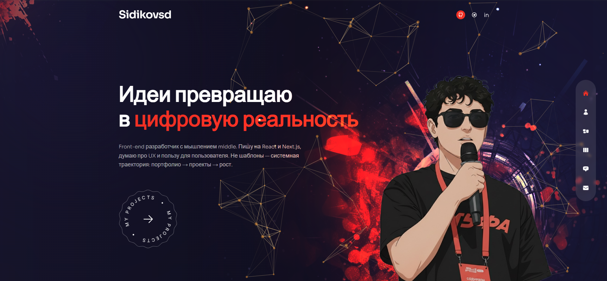

<a name="readme-top"></a>

# Портфолио — Сидиков Содирхон (Sid)

Личный сайт-портфолио front-end разработчика. Next.js, React, Framer Motion, Tailwind CSS.

[](https://github.com/Sidikov213)
[](https://t.me/sidikovsd)
[](LICENSE)

**Сайт в сети:** [sidikovsd.ru](https://sidikovsd.ru)

---

## Скриншот сайта



*Главная страница — [sidikovsd.ru](https://sidikovsd.ru)*

---

## Обо мне

Front-end разработчик с фокусом на React и Next.js. Делаю адаптивные сайты, думаю про UX и пользу для пользователя. Реальные проекты: сайт барбершопа Hairlab, портфолио, блог, формы и авторизация, Telegram-бот.

**Стек:** JavaScript / TypeScript, React, Next.js, Tailwind CSS, Framer Motion, Swiper.

**Планы:** углубление React/Next.js, Dart/Flutter, 3D и интерактив (Three.js, R3F, GSAP).

---

## Содержание

- [Скриншот сайта](#-скриншот-сайта)
- [Структура проекта](#-структура-проекта)
- [Запуск](#-запуск)
- [Технологии](#-технологии)
- [Проекты в портфолио](#-проекты-в-портфолио)
- [Контакты](#-контакты)

---

## Структура проекта

```
modern-portfolio/
├── components/       # Компоненты (Layout, Nav, слайдеры, аватар и т.д.)
├── pages/           # Страницы Next.js
│   ├── index.jsx    # Главная
│   ├── about/       # Обо мне
│   ├── services/    # Навыки
│   ├── work/        # Проекты
│   ├── testimonials/# Отзывы
│   ├── contact/     # Контакты
│   └── _app.jsx
├── public/          # Статика (изображения, favicon)
├── styles/
│   └── globals.css
├── variants.js      # Анимации Framer Motion
├── tailwind.config.js
├── next.config.js
└── package.json
```

---

## Запуск

1. Установи **Node.js** и **Git**.

2. Клонируй репозиторий:
   ```bash
   git clone https://github.com/Sidikov213/modern-portfolio.git
   cd modern-portfolio
   ```

3. Установи зависимости:
   ```bash
   npm install --legacy-peer-deps
   ```

4. Запусти dev-сервер:
   ```bash
   npm run dev
   ```

5. Открой [http://localhost:3000](http://localhost:3000).

**Сборка и продакшен:**
```bash
npm run build
npm run start
```

---

## Технологии

- **Next.js** — фреймворк, роутинг, SSR
- **React** — UI
- **Tailwind CSS** — стили
- **Framer Motion** — анимации и переходы между страницами
- **Swiper** — слайдеры (проекты, навыки, отзывы)
- **react-tsparticles** — частицы на главной
- **react-countup** — счётчики на странице «Обо мне»
- **react-icons** — иконки
- **@next/font** (Sora) — шрифт

---

## Проекты в портфолио

| Проект | Описание | Репозиторий |
|--------|----------|-------------|
| Barbershop Hairlab | Реальный бизнес-сайт барбершопа | [GitHub](https://github.com/Sidikov213/Barbershop_hairlab) |
| Портфолио (Next.js) | Основное портфолио на Next.js, TS, Tailwind | [GitHub](https://github.com/Sidikov213/my_portfolio) |
| Blog App | Блог-приложение | [GitHub](https://github.com/Sidikov213/blog-app) |
| Регистрация / Auth | Формы, авторизация | [GitHub](https://github.com/Sidikov213/regist_site) |
| TG-бот (Python) | Telegram-бот | [GitHub](https://github.com/Sidikov213/TG_bot_alfha) |

---

## Контакты

- **GitHub:** [Sidikov213](https://github.com/Sidikov213)
- **Telegram:** [@sidikovsd](https://t.me/sidikovsd)
- **LinkedIn:** [sidikov213](https://linkedin.com/in/sidikov213)

Форма обратной связи на сайте настроена на Netlify Forms (при деплое на Netlify).

---

## Деплой

- **Живой сайт:** [sidikovsd.ru](https://sidikovsd.ru)
- **Vercel:** [Документация Next.js по деплою](https://nextjs.org/docs/deployment)
- **Netlify:** поддерживается сборка Next.js

---

<p align="right"><a href="#readme-top">↑ Наверх</a></p>
